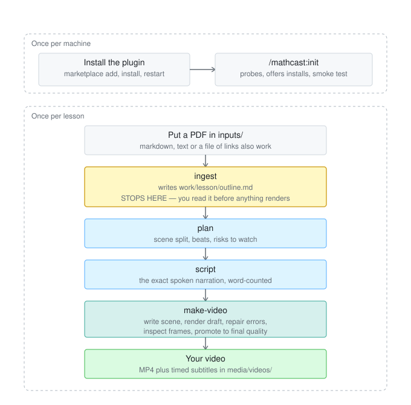

# mathcast

Turn maths and science learning material — PDFs, Markdown, notes — into narrated
[Manim](https://docs.manim.community/) animations. A [Claude Code](https://claude.com/claude-code)
plugin.

You put a lesson in `inputs/`. Claude extracts it into a reviewable outline, plans the scenes,
writes the narration, generates the Manim code, renders it, fixes what breaks, **looks at the
rendered frames** to catch layout problems no test can see, and produces an MP4 with synchronised
narration and subtitles.

---

## Contents

- [What it does](#what-it-does) · [Requirements](#requirements) · [Install](#install)
- [Set up a project](#set-up-a-project) · [Make a video](#make-a-video) · [Narration](#narration)
- [What you get](#what-you-get) · [Status](#status) · [Repository layout](#repository-layout)
- [Uninstall](#uninstall) · [Community](#community) · [Contributing](#contributing) · [License](#license)

---

## What it does

<p align="center">
  
</p>

Each stage writes a file you can read and edit. **Only `ingest` stops for you** — a misreading is
cheap to fix in an outline and expensive after a render. Everything after it runs through.

**The repair loop is the point.** Generated Manim code fails in four ways: syntax errors, runtime
errors, **layout errors** (overlapping labels, off-screen objects), and pedagogical errors. A
script can catch the first two. The third needs someone to look at a rendered frame — which is
why this is a Claude Code plugin and not a pipeline script.

On real runs, frame inspection has caught an equation colliding with a title, a value animating
through three fading equations, and narration describing one thing while a different thing was
highlighted. **All three rendered without any error at all.**

---

## Requirements

`/mathcast:init` probes for these and, where it can, offers to install them.

| | Why | Check |
|---|---|---|
| **Python 3.11+** | Everything | `python --version` |
| **FFmpeg** | Muxing video and audio | `ffmpeg -version` |
| **LaTeX** — [MiKTeX](https://miktex.org/) or [TeX Live](https://tug.org/texlive/) | `MathTex` compilation | `latex --version` |
| **`dvisvgm`** | Ships with both, but check — LaTeX can be present and `MathTex` still fails without it | `dvisvgm --version` |
| **`pkg-config`** *(macOS only)* | `pip install manim` fails building `pycairo` without it | `pkg-config --version` |

**`/mathcast:init` can set most of this up for you.** It detects which package managers are
actually on your machine — `winget`, `choco`, `scoop`, `brew`, `apt`, `dnf`, `pacman` — tells you
exactly what it proposes to run and how big the download is, and **asks before installing
anything**.

```bash
pip install manim manim-voiceover gTTS      # or let init offer it
```

Two deliberate limits:

- **It never runs `sudo`.** On Linux it prints the command for you to run in your own shell,
  where you can see what it's asking for.
- **If no package manager is found** it gives you the official download links and stops.

---

## Install

From the Claude Code prompt:

```
/plugin marketplace add F3rNaNDEZ57/mathcast
/plugin install mathcast@mathcast
```

Or from a terminal:

```bash
claude plugin marketplace add F3rNaNDEZ57/mathcast
claude plugin install mathcast@mathcast
```

**Restart Claude Code** — plugins load at session start.

<details>
<summary>Local development from a clone</summary>

```bash
git clone https://github.com/F3rNaNDEZ57/mathcast
claude plugin marketplace add ./mathcast
claude plugin install mathcast@mathcast
```

Note that plugin updates are **version-gated**: editing a file and merging it delivers nothing
until `version` in `.claude-plugin/plugin.json` changes. Bump it, then
`claude plugin marketplace update mathcast && claude plugin update mathcast`.
</details>

---

## Set up a project

In the directory where you want your videos:

```
/mathcast:init
```

It probes rather than assumes, then:

1. **Reports your toolchain** — versions and what's missing, then offers to install what it
   can, asking first and telling you the download size. It never runs `sudo`.
2. **Checks your network** for a black-holed IPv6 route — a real and surprisingly common fault
   where IPv6 is advertised but unroutable, which makes every cloud-TTS call stall ~21s. On an
   affected machine that turns a 56-second render into 65 minutes.
3. **Scaffolds** `inputs/ work/ generated/ media/` and a `.gitignore`.
4. **Picks a speech service** — and recommends the offline one if your network is the problem.
5. **Runs a smoke test** that exercises Manim, LaTeX, TTS and FFmpeg together.

---

## Make a video

Put your material in `inputs/` — a PDF, Markdown, plain text, or a file of URLs — then just ask:

```
ingest the PDF in inputs/
```

You get `work/<lesson>/outline.md`: the concepts in teaching order, the exact LaTeX, how each
symbol should be *spoken*, and — importantly — **a "Flagged for review" section** listing what the
extraction was unsure about, what it had to infer, and what the source is missing.

Read that. It's the cheapest place to catch a problem. Then:

```
make a video from work/<lesson>/
```

Claude plans the scenes, writes the narration, generates the Manim code, renders a draft, repairs
errors, inspects the frames, and promotes to 1080p60 once clean. It tells you the scene class name
and the output path.

To revise, just say so — the generated `.py` stays in `generated/`, and the TTS cache means
unchanged narration isn't re-synthesised.

---

## Narration

**gTTS** is the default: nothing to install, no API key. It calls Google **at render time**, so
rendering needs a network connection.

**Kokoro** is the offline option, and `/mathcast:init` offers it — Kokoro-82M, Apache-2.0, 54
voices, **~1.4s per clip**, no key and no network once the model is cached. Install in **two
steps**:

```bash
pip install kokoro-onnx soundfile
pip install kokoro-manim-voiceover --no-deps
```

> [!WARNING]
> Do **not** run `pip install kokoro-manim-voiceover` on its own. `manim-voiceover` pins
> `python-dotenv<0.22.0`, so a plain install **downgrades `python-dotenv` and breaks `fastmcp-slim`
> and `mcp`** if you use MCP tooling. `--no-deps` also avoids `manim-dsa`, a declared dependency
> the package never imports.

Kokoro needs ~338 MB of model files. Keep them in a shared cache and pass the paths explicitly —
otherwise the package downloads them into your current working directory, per project.

<details>
<summary>Other speech services, and word-level timing</summary>

`manim-voiceover` also ships `OpenAIService`, `ElevenLabsService`, `AzureService`, `CoquiService`,
`PyTTSX3Service` and `RecorderService`. Swapping is one line in the scene — but each needs its own
optional extra installed first; only `OpenAIService` works out of the box. There is **no Piper
service**, despite what some older write-ups claim.

Word-level timing for `wait_until_bookmark()` does **not** depend on the service. Pass
`transcription_model="base"` to any of them and `manim-voiceover` runs Whisper over the audio:

```bash
pip install "manim-voiceover[transcribe]"
```
</details>

---

## What you get

| Path | |
|---|---|
| `media/videos/<scene>/1080p60/<Scene>.mp4` | The final render |
| `media/videos/<scene>/1080p60/<Scene>.srt` | Subtitles, timed to the narration |
| `media/videos/<scene>/480p15/` | Draft renders |
| `work/<lesson>/` | Outline, plan and script — readable and editable |
| `generated/<scene>.py` | The Manim scene, kept for re-rendering |

If a lesson is split across scenes you get one MP4 each, joined manually:

```bash
ffmpeg -f concat -safe 0 -i list.txt -c copy lesson.mp4
```

Splitting is deliberately rare — the default is one scene per lesson.

---

## Status

**Early, but the whole chain works.** Honest account of what has and hasn't been exercised:

**Proven on real material**
- The full chain run front-to-back from a PDF: ingest → plan → script → render → repair → inspect
- Generation on unfamiliar subject matter — a first-time clean render on a new source and topic
- The repair loop against import errors and two Manim API errors
- Frame inspection catching layout *and* semantic defects
- Kokoro local narration, and duration prediction accurate to ~4% from word count
- Installing and updating from the marketplace
- `/mathcast:init` run end to end against a clean project, including package-manager detection

**Not yet exercised**
- PDFs over 10 pages — every input so far has been short
- Link ingestion — written, never run
- LaTeX compile errors in the repair loop
- A split scene join without a visible seam at the cut
- `init`'s **`brew` and `sudo` hand-off branches** — developed on Windows, so only the
  `winget`/`choco` paths have actually run

Expect to steer it.

---

## Repository layout

| Path | |
|---|---|
| `.claude-plugin/` | `plugin.json` and `marketplace.json` |
| `commands/init.md` | `/mathcast:init` |
| `skills/ingest/` | Material → outline. The review gate |
| `skills/plan/` | Outline → scene split, beats, risks |
| `skills/script/` | Plan → the exact spoken narration, word-counted |
| `skills/make-video/` | Render, repair and inspect loop |
| `assets/probe_env.py` | Toolchain, network and TTS probe — bounded timeouts, never hangs |
| `assets/test_voiceover.py` | Toolchain smoke test |
| `assets/ipv4_first_template.py` | IPv6 shim, copied into a project **only** if the probe finds the fault |
| `inputs/` | Your material — gitignored |
| `work/`, `generated/`, `media/` | Working files and output — gitignored |
| `docs/pipeline.svg` | The diagram at the top of this file |
| `CONTRIBUTING.md` | How to contribute, and the rules that bind |
| `CLAUDE.md` | Notes for anyone (or any agent) working on the plugin itself |

---

## Uninstall

```bash
claude plugin uninstall mathcast
claude plugin marketplace remove mathcast
```

Both leave the cached clone behind. To remove it completely:

```bash
rm -rf ~/.claude/plugins/cache/mathcast
```

Your projects, videos and `inputs/` are untouched — nothing lives inside the plugin.

---

## Community

- **[Discussions](https://github.com/F3rNaNDEZ57/mathcast/discussions)** — questions, ideas, and
  showing a video you made with it
- **[Issues](https://github.com/F3rNaNDEZ57/mathcast/issues)** — bugs and concrete proposals

## Contributing

[CONTRIBUTING.md](CONTRIBUTING.md) has the detail. The short version — three rules that carry
most of the weight, each because breaking one has already cost this project time:

- **The render → repair → inspect loop stays in one context.** It works because a single context
  holds the lesson, the scene, the traceback and the frames at once. Splitting it across
  sub-agents breaks the only part that's been proven.
- **A fix isn't shipped until the version bumps.** Plugin updates are version-gated.
- **"Works" means someone ran it.** Unverified work is welcome; unverified work described as
  working is not.

**Good places to start** are the gaps in [Status](#status) above — `init` has never run on macOS
or Linux, and link ingestion has never run at all. A bug report on any of them is as useful as
a fix.

`CLAUDE.md` carries the design constraints an agent should read first.

---

## License

[Apache-2.0](LICENSE).

Built on [Manim Community](https://www.manim.community/) and
[manim-voiceover](https://github.com/ManimCommunity/manim-voiceover). Optional local narration uses
[Kokoro-82M](https://huggingface.co/hexgrad/Kokoro-82M) via
[kokoro-manim-voiceover](https://github.com/xposed73/kokoro-manim-voiceover).
